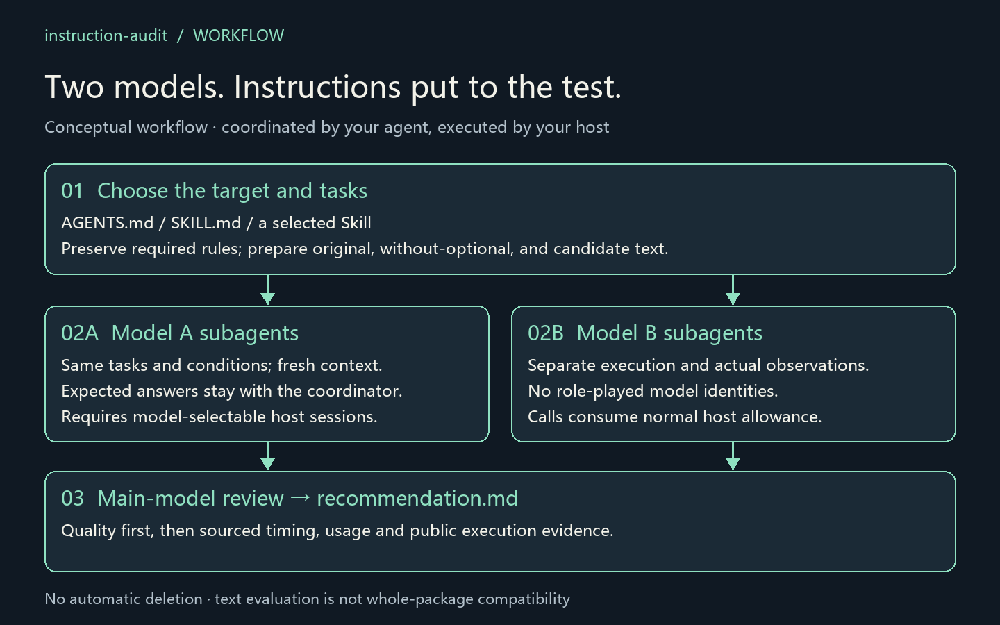
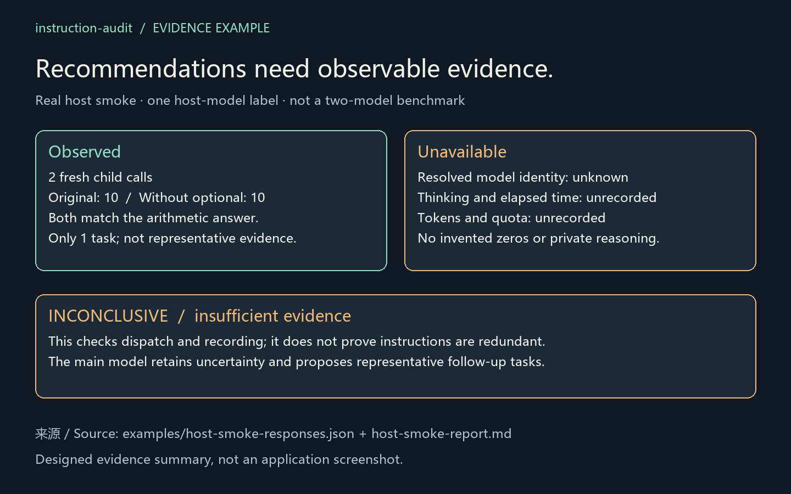

# instruction-audit

**Keep the instructions that still help. Test the ones that might not.**

An installable Skill that lets your agent compare **two user-selected models** on an `AGENTS.md` or a specific Skill, then recommend what to keep or simplify using task quality, observed timing, usage and public execution evidence.

**Existing host authentication · Fresh model-specific subagents · No separate API key · MIT**

[简体中文](README.zh-CN.md) · [Install](#install) · [Usage examples](#usage-examples) · [Evidence and limits](#evidence-and-limits)



## What it does

| Capability | What you get |
| --- | --- |
| Audit your chosen instructions | Select `AGENTS.md`, `SKILL.md`, a Skill directory, or an unambiguous installed Skill name |
| Compare two models | The coordinator selects actual host model IDs and launches fresh model-specific children |
| Compare instruction conditions | Original, optional instructions removed, and an optional shorter candidate; required rules stay in every condition |
| Record evidence | Task assertions, failures, identity/isolation metadata, and available host metrics with their sources |
| Review retention value | The main model writes `recommendation.md` with per-model keep/simplify proposals and uncertainty |

The Skill uses the host's existing authenticated model tools. It does not contain a provider API client, run a proxy, or extract login credentials. **No separate API key does not mean free or unlimited use:** host subscription limits and model permissions still apply.

## Install

Prerequisites: a Skill-capable agent host. Automated two-model execution also needs fresh child sessions and explicit model selection. The optional local helpers require **Python 3.10+**, with no third-party runtime dependencies.

Copy the complete `skills/instruction-audit` folder from this repository into your host's Skill directory. For Codex project scope:

```text
your-project/
└── .agents/
    └── skills/
        └── instruction-audit/
            ├── SKILL.md
            ├── agents/
            ├── references/
            └── scripts/
```

Codex also supports user scope at `~/.agents/skills/instruction-audit`. If using the standalone install ZIP, its top-level `instruction-audit` folder is already the installable unit. Preserve existing local edits when updating. Reload the host if it has not discovered the Skill.

Other hosts need their own Skill installation location and compatible delegation tools; universal host compatibility has not been verified. See [host execution](skills/instruction-audit/references/host-execution.md).

## Usage examples

### 1. Compare AGENTS.md on two models

> Use $instruction-audit to compare this project's AGENTS.md on GPT-5.6 Sol and GPT-6 Astra. Use two representative tasks, original versus optional-instructions-removed conditions, one repeat each, and at most eight calls. Preserve mandatory project and safety rules.

The example names must map to accessible models in your host. Two models × two conditions × two tasks = **8 fresh child calls**. Adding a shorter candidate makes 12. Unavailable models are reported, not silently replaced.

### 2. Evaluate a specific Skill

> Use $instruction-audit on ./my-skill/SKILL.md with the two models I selected. Design tasks matching what this Skill actually does. Keep required tools and resources available in every condition. Recommend which sections to keep or simplify.

You can instead name an installed Skill. The coordinator resolves the exact entry point and asks only if the name is ambiguous. Testing instruction text alone does not establish whether the whole package, its scripts or automatic triggering can be removed.

### 3. Ask for a final evidence review

> After the trials, write recommendation.md. Prioritize correctness and required behavior, then compare measured elapsed time, host-reported thinking time, tokens, separately attributed quota, and visible tool/retry behavior. Mark unavailable metrics as unknown and cite trial IDs for each recommendation.

The main model performs this review. Solvers do not grade their own instruction value. Public execution summaries may be used; hidden chain-of-thought is neither requested nor stored.

### 4. Prepare a reproducible text-task comparison

For authors who want explicit files, run from the repository root:

```sh
python skills/instruction-audit/scripts/build_agents.py examples/case.json --target ./my-skill --models MODEL_A MODEL_B --available-models MODEL_A MODEL_B --max-trials 8 --out comparison-run
```

Replace the model IDs with those actually reported by the host. Replace the toy tasks in `examples/case.json` with suitable tasks before making retention claims. The source case remains unchanged.

This command **prepares** prompts and `dispatch.json`; it makes no model calls. The coordinating agent must execute the plan through host tools, record responses, and generate the report. See the [helper protocol](skills/instruction-audit/references/helper.md) and [subagent workflow](skills/instruction-audit/references/build-agents.md).

## What comes back

| Output | Author | Contents |
| --- | --- | --- |
| `manifest.json` | Helper | Target, tasks, expected answers and trial matrix; coordinator-only |
| `prompts/` + `dispatch.json` | Helper | Individual prompts and model-specific launch arguments |
| `results/` | Coordinator + helper | Actual responses, local checks, metadata and optional telemetry |
| `report.md` | Helper | Quality observations, uncertainty, timing/usage coverage and failure rows |
| `recommendation.md` | Main model | Concrete per-model retention proposals linked to evidence |

The report filename is chosen with `audit.py report --out`; the main model writes the recommendation separately. No script automatically edits or deletes your instructions.

## Evidence and limits



This illustration summarizes the [recorded host smoke test](examples/host-smoke-report.md): two real child calls, one arithmetic task, unknown resolved model identity. It validates dispatch and recording, **not cross-model effectiveness**. The workflow illustration is conceptual; neither image is a product screenshot.

- **Quality comes first.** A faster incorrect answer is not an improvement. Small toy samples cannot establish general redundancy.
- **Time and usage are distinct.** Elapsed time is not thinking time; tokens are not subscription quota. Missing data is unknown, not zero. Account-wide quota changes are not automatically attributable to one trial.
- **Isolation matters.** Reused sessions, inherited target instructions, unknown identity or incomplete trials keep conclusions inconclusive. No fresh-session support means a static review and a NOT EXECUTED plan.
- **Scope matters.** The helper grades exact text answers. Code/artifact tasks need project tests. Native Skill discovery and whole-package behavior need separate checks.
- **Suggestions remain reviewable.** A simplify proposal may be an unverified candidate, never proof of redundancy or permission for automatic deletion.

Current validation: **22 tests passed, 1 Windows symlink test skipped**. Hosted CI is configured but not claimed as executed. See [the full validation record](VALIDATION.md).

## Friends

[Linux DO](https://linux.do/)
