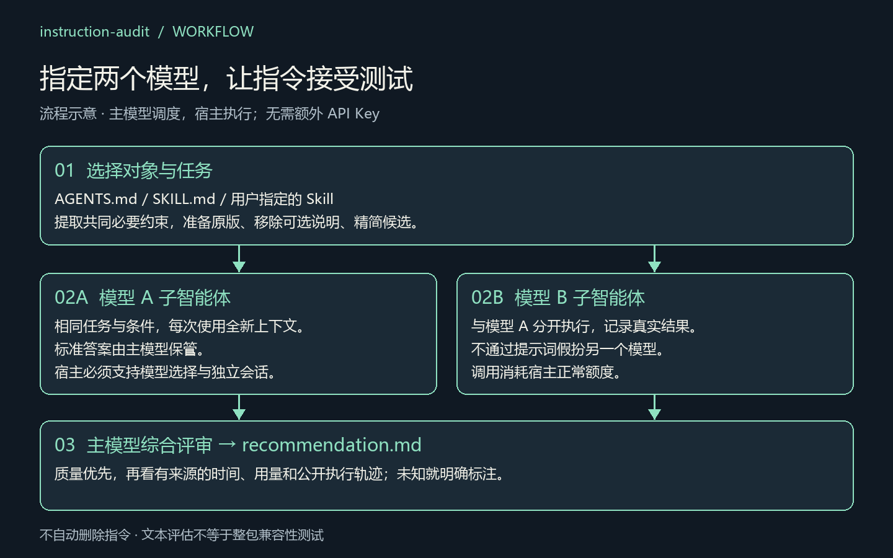
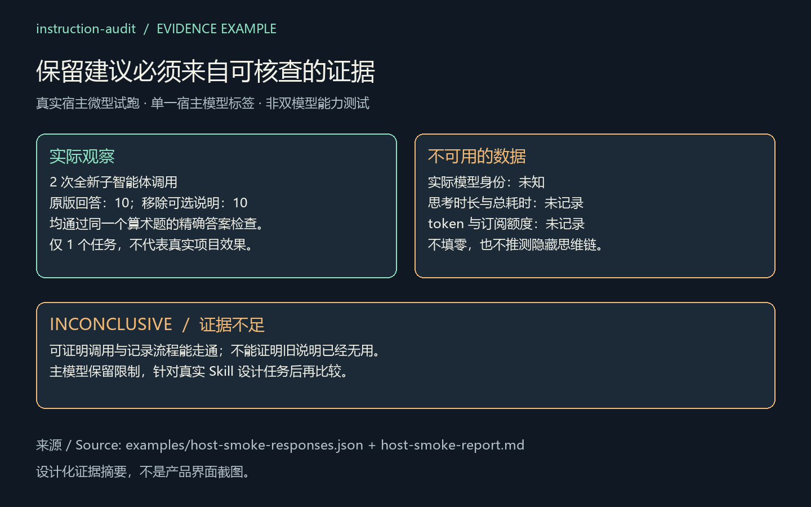

# instruction-audit

**留下仍然有用的指令，用测试判断哪些可以精简。**

一个可安装的 Skill：让主智能体调用用户指定的**两个模型子智能体**，比较 `AGENTS.md` 或某个 Skill 的指令价值，再结合结果质量、时间、用量与公开执行证据提出保留建议。

**沿用宿主登录态 · 模型专属子智能体 · 无需额外 API Key · MIT 开源**

[English](README.md) · [安装](#安装) · [使用示例](#使用示例) · [证据与边界](#证据与边界)



## 能做什么

| 功能 | 得到什么 |
| --- | --- |
| 指定评估对象 | 支持 `AGENTS.md`、`SKILL.md`、Skill 目录或可唯一定位的已安装 Skill 名称 |
| 指定两个模型 | 主智能体核对宿主模型标识，启动对应模型的全新子智能体 |
| 比较不同说明版本 | 原版、移除可选说明、可选的精简候选；所有条件保留共同必要要求 |
| 记录有来源的证据 | 任务断言、失败记录、模型身份与隔离信息，以及宿主可提供的时间和用量 |
| 给出保留建议 | 主模型撰写 `recommendation.md`，逐模型说明保留、精简候选和证据不足之处 |

Skill 使用宿主已有登录态和模型调用工具，不包含模型 API 客户端、代理服务或凭证提取逻辑。**无需新 API Key 不等于免费或无限使用**：测试仍受宿主订阅额度和模型权限限制。

## 安装

需要支持 Skill 的智能体宿主。自动跨模型测试还需要宿主能够指定模型、启动全新的子会话。可选的本地辅助脚本要求 **Python 3.10+**，运行时无第三方依赖。

将仓库中的整个 `skills/instruction-audit` 文件夹复制到宿主的 Skill 目录。以 Codex 项目级安装为例：

```text
你的项目/
└── .agents/
    └── skills/
        └── instruction-audit/
            ├── SKILL.md
            ├── agents/
            ├── references/
            └── scripts/
```

Codex 用户级目录也可使用 `~/.agents/skills/instruction-audit`。如果下载的是独立安装 ZIP，解压后的顶层 `instruction-audit` 就是完整安装单元。更新前保留本地修改；宿主尚未发现新 Skill 时重新加载。

其他宿主请使用其自己的 Skill 目录，并确认委派工具兼容。项目尚未验证所有智能体平台，详见[宿主执行说明](skills/instruction-audit/references/host-execution.md)。

## 使用示例

### 1. 比较两个模型对 AGENTS.md 的需求

> 使用 $instruction-audit，让 GPT-5.6 Sol 和 GPT-6 Astra 比较这个项目的 AGENTS.md。选择两个有代表性的任务，对照原版与去除可选说明，每个条件运行一次，最多调用 8 次。保留必要业务规则和安全要求。

模型名称需能映射到宿主实际可用的模型。两个模型 × 两个条件 × 两个任务，共 **8 次全新子智能体调用**；增加精简候选条件则为 12 次。指定模型不可用时明确报告，不会静默替换。

### 2. 比较用户指定的 Skill

> 使用 $instruction-audit，评估 ./my-skill/SKILL.md 在我指定的两个模型上是否仍有价值。任务要符合这个 Skill 的实际用途，各条件都保留必需工具和资源。告诉我哪些章节应保留、哪些可以精简。

也可以直接说出已安装 Skill 的名称。主智能体会定位具体入口，存在重名时才询问。仅测试说明文本，不能证明整个包、脚本或自动触发能力都可以删除。

### 3. 要求主模型综合评审

> 测试结束后生成 recommendation.md。先看正确性和必要行为，再比较实际耗时、宿主公开的思考时长、token、可归属到本次调用的额度，以及工具调用和重试行为。缺失数据标为未知，每条建议引用对应测试记录。

评审由主模型完成，不让子智能体自行评价自己的指令是否有用。“思考过程”采用公开执行轨迹和简短说明，不索取或保存隐藏思维链。

### 4. 用文件准备可复现的文本任务实验

希望明确管理任务文件时，可在仓库根目录运行：

```sh
python skills/instruction-audit/scripts/build_agents.py examples/case.json --target ./my-skill --models MODEL_A MODEL_B --available-models MODEL_A MODEL_B --max-trials 8 --out comparison-run
```

将模型 ID 替换为宿主实际提供的标识；要判断真实指令价值，先把 `examples/case.json` 的算术玩具任务改成适合目标 Skill 的任务。原始配置不会被修改。

这个命令**只准备**提示词与 `dispatch.json`，不会调用模型。随后由主智能体通过宿主工具执行计划、记录响应并生成报告。完整步骤见[辅助脚本协议](skills/instruction-audit/references/helper.md)和[子智能体流程](skills/instruction-audit/references/build-agents.md)。

## 最终得到什么

| 文件 | 谁生成 | 内容 |
| --- | --- | --- |
| `manifest.json` | 辅助脚本 | 对象、任务、标准答案与测试矩阵；仅供主智能体使用 |
| `prompts/` 和 `dispatch.json` | 辅助脚本 | 单次提示词与对应模型的启动参数 |
| `results/` | 主智能体与辅助脚本 | 实际回答、断言结果、元数据及可选测量值 |
| `report.md` | 辅助脚本 | 质量观察、不确定性、时间与用量覆盖情况、失败记录 |
| `recommendation.md` | 主模型 | 分模型的具体保留建议及依据 |

报告文件名由 `audit.py report --out` 指定；主模型另写建议文件。脚本不会自动改写或删除你的指令。

## 证据与边界



上图来自[真实宿主微型试跑](examples/host-smoke-report.md)：两次真实子智能体调用、一个算术任务、实际模型身份未知。它验证了调用与记录流程，**不是双模型效果证明**。流程图为设计示意，两类图片都不是产品界面截图。

- **质量优先。** 更快的错误答案不算改进；少量玩具题不能证明指令普遍无用。
- **时间与额度分开。** 总耗时不等于思考时长，token 不等于订阅额度。缺失数据是未知，不是零；账号总额度变化不能直接归给某个子智能体。
- **独立上下文很重要。** 会话复用、旧指令被继承、身份未知或任务不完整时，保留证据不足的结论。无法新建上下文时只提供静态审查与未执行计划。
- **评估范围要明确。** 辅助脚本对文本答案做精确检查；复杂代码和产物需要项目测试，原生发现和整包行为需要单独验证。
- **建议可供审阅。** 精简建议可能只是待验证候选，不等于已证明冗余，也不会触发自动删除。

当前验证：**22 项测试通过，1 项因 Windows 符号链接权限跳过**。已配置跨平台 CI，但不声称远程任务已运行。详见[完整验证记录](VALIDATION.md)。

## 开发与进一步阅读

```sh
python -m unittest discover -s tests -v
```

- [Skill 入口](skills/instruction-audit/SKILL.md)
- [指定 Skill 的评估范围](skills/instruction-audit/references/selected-skill.md) · [主模型评审方法](skills/instruction-audit/references/final-review.md)
- [安全说明](SECURITY.md) · [贡献指南](CONTRIBUTING.md) · [更新日志](CHANGELOG.md)
- [源码发布步骤](RELEASING.md) · [插图来源与复现](assets/README.md)

这是独立的 Skill 项目，不需要安装另一个 `skill-smoke` CLI。项目已准备好源码交付，但不代表已远程发布或已完成真实双模型效果验证。